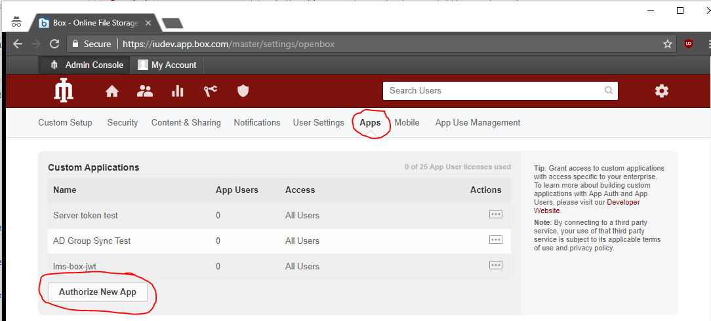
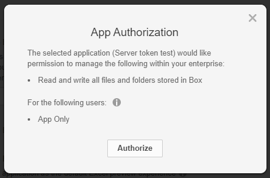
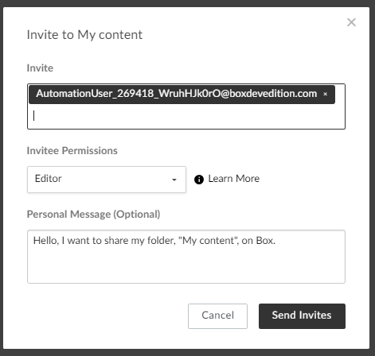
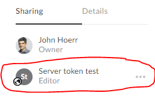

# Box + JWT Primer

This document describes a method for provisioning Box applications using OAuth2 with JWT. It is aimed at developers wishing to build server-based applications or scripts that target personal- or group-owned enterprise content. 

## OAuth 2 with JSON Web Tokens (JWT)

Traditional "3-legged" OAuth was designed for mobile/browser application development. It enables users to securely share their content (such as Box files) with a 3rd party application and revoke that permission at any time. For many years this was the only authentication method provided by Box.

3-legged OAuth has some design features that make it great for mobile/browser apps but difficult to use with enterprise/administrative scripts and applications. The browser-based authentication model requires human interaction and is difficult to script. It requires the application to maintain and update certain pieces of authorization state over time, the loss of which can disable the application. It does not play nicely in environments with concurrent/HA processes.

OAuth 2.0 with JSON Web Token (JWT) has emerged as an alternative to the traditional "3-legged" OAuth authentication model. It differs from 3-legged OAuth in some key ways that make it more suitable for server-based applications:

+ **JWT auth does not require human interaction beyond the initial setup and configuration.** During the configuration process a developer will select the permissions the application will need to do to perform its tasks (e.g. 'Manage Enterprise Users' or 'Manage Groups'). An Enterprise co-admin pre-authorizes the application with those specific permissions. The JWT authorization process is then fully programmatic and no browser interaction is required.

+ **JWT auth is designed for multi-process/multi-node/HA environments.** Multiple API access tokens can be in use at any given time across multiple processes/nodes. When a process needs an API access token, it simply requests one from Box using a request signed by the applications' private key.

+ **JWT access tokens are stateless.** When an access token expires it is not refreshed; you simply request a new one. Eliminating refresh tokens reduces the amount of state that must be maintained and managed by the application, and removes the risk and frustration of disabling the application following a failure to properly maintain refresh tokens.

## Box Service Accounts vs Box Enterprise Accounts

Applications using 3-legged OAuth are typically intended to interact with an individual Enterprise user's account. That authorization process results in an access token that is tied to some existing Box account.

Server-based JWT-based applications *may* access user data, but they may have other intended uses: updating Box group definitions, syncing user accounts, etc. Therefore, a JWT applicaton is associated with a Service Account that is created automatically when you setup the JWT app.

The Service Account is a full-fledged Box account, however it is not directly tied to your Box Enterprise, nor can it be viewed or managed through your standard Enterprise administration tools. Nevertheless, Service Accounts are an ideal model for fine-grained access control:

+ By default, a JWT application has no access to your existing Enterprise content. Access to content can be selectively granted and managed through collaborations. 
+ Unlike 3-legged OAuth, a JWT app's permissions are not related to an existing Enterprise user. The JWT app will be granted the exact permissions that you select when configuring the app.

# Creating a Box JWT Application

Refer to the Box documentation on [Authentication with JWT](https://developer.box.com/docs/authentication-with-jwt) for detailed information on working with JWT applications. Note that the Box documentation refers to certain Box Platform features such as 'App Auth' and 'App Users' which also use JWT but are not intended to work with existing Enterprise content.

## Generate a Public/Private Keypair

### On Windows

1. Download and install 'Win64 OpenSSL' from https://slproweb.com/products/Win32OpenSSL.html. 
2. Generate private key:
```
C:\OpenSSL-Win64\bin> openssl genrsa -aes256 -out private_key.pem 2048
```
3. Generate a public key from the private key:
```       
C:\OpenSSL-Win64\bin> openssl rsa -pubout -in private_key.pem -out public_key.pem
```
4. (Optional) Strip the passphrase from the private key. If you elect to keep the password you will have to supply it to the script that accesses the cert, either via an environment variable (good!) or plain text (bad!)
```
C:\OpenSSL-Win64\bin> openssl rsa -in private_key.pem -out private_key_nopass.pem
```

### On Mac/Linux
1. Generate private key:
```
> openssl genrsa -aes256 -out private_key.pem 2048
```
2. Generate a public key from the private key:
```       
> openssl rsa -pubout -in private_key.pem -out public_key.pem
```
3. (Optional) Strip the passphrase from the private key. If you elect to keep the password you will have to supply it to the script that accesses the cert, either via an environment variable (good!) or plain text (bad!)
```
> openssl rsa -in private_key.pem -out private_key_nopass.pem
```

## Configure a New JWT Application

1. Browse to https://developers.box.com/ and Log In.
2. Choose **Create New App** in the upper-right corner.
3. On the _Let's Get Started_ page, choose **Enterprise Integration**. Click **Next**.
4. On the _Authentication Method_ page, chose **OAuth 2.0 with JWT (Server Authentication)**. Click **Next**.
5. On the _What would you like to name your app?_ page, select a meaningful name for your application. Note that this will be the name visible to users on any collaboration folders to which this app has access. Click **Create App**.
6. Click **View Your App**
7. Configure the applications permissions under _Application Scopes_, _Application Scopes_, and _Advanced Features_. The following diagram represents the most restrictive (safest) permission set. You can select elevated permissions to satisfy the requirements of your application.

8. Under _Add and Manage Public Keys_ choose **Add a Public Key**. Open your *public_key.pem* file and paste the content of that file into the dialogue box.
9. Click **Save Changes** to finalize your configuration.

You can come back and update this configuration at any time, however if you modify the application permissions it must be reauthorized by an enterprise co-admin.

## Pre-Authorize the JWT Application

JWT apps differ from 3-legged apps in that they are pre-authorized by your Enterprise Co-Admin for use with their requested permissions. The Co-Admin can revoke authorization at any time, and reauthorization is required if the permission set is ever changed.

### For Developers

From your JWT app Configuration screen, scroll to the _OAuth 2.0 Credentials_. Send the _Client ID_ to your Box Enterprise Co-Admin. The Client _ID_ is not a secret and can safely be sent in email or chat.


### For Co-Admins

1. Browse to your Admin Console, select the **Gear** symbol in the upper-right of the screen, and select **Elite Settings**

2. Select the **Apps** tab. Under _Custom Applications_ choose **Authorize New App**.

3. In the _API Key_ field, paste in the _Client ID_ that was sent to you by the Developer. Click **Next**.
4. Review the requested permissions. Contact the Developer if you wish to inquire as to why a specific permission is required. Click **Authorize** to finalize the approval process.

5. The JWT app is now authorized for use and will apear under the list of _Custom Applications_.

# Using your JWT Application

## Discover the Service Account Login

In order to invite the Service Account to collaborate on Enterprise content you must first determine its login. This requires that you programatically authenticate as the JWT app and fetch the metadata for the authenticated user.

Authenticating with JWT requires several parameters:

1. The JWT application _Client ID_ and _Client Secret_, located in the _OAuth 2.0 Credentials_ section of the JWT app configuration.
2. The JWT application _Public Key ID_, located in the _Add and Manage Public Keys_ section of the JWT app configuration.
3. The ID of the Enterprise in which the JWT app was created. You may need to consult with your Enterprise Co-Admin to find this value.
4. The path to the private key file. This path must be accessible from the machine on which the script is run.

### Python Example

#### Modules

* pip install boxsdk --pre
* pip install boxsdk[jwt] --pre

#### Code

```python
# load the private key passphrase from the environment
import os
privateKeyPassphrase = os.environ['jwtPrivateKeyPassword']

# Create an authentication object using the JWT parameters for the application.
from boxsdk import JWTAuth, Client

auth = JWTAuth(
    client_id='8grfp2owbhpa2qrnsw4c5urmlwh5ybdz',
    client_secret='1FwTmLNWRbuSjWx7M6dTSUBS6k5h3x1y',
    enterprise_id='322105',  # IU's Dev Enterprise ID; yours may differ.     
    jwt_key_id='uaigav1k',   # the Public Key ID
    rsa_private_key_file_sys_path='C:\\OpenSSL-Win64\\bin\\private_key.pem',
    rsa_private_key_passphrase=str.encode(privateKeyPassphrase)
)

# Authenticate the JWT instance.
token = auth.authenticate_instance()

# Create an authenticated client that can interact with the Box Content API
client = Client(auth)

# Fetch the name and login (email address) of the JWT app Service Account
service_account = client.user().get()
print ('Service Account name:  ' + service_account.name)
print ('Service Account login: ' + service_account.login)
```

#### Output

```
Service Account name:  Server token test
Service Account login: AutomationUser_269418_WruhHJk0rO@boxdevedition.com
```

### .Net Example

#### NuGet Packages

* Box.V2
* Box.V2.JWTAuth

#### Code

```csharp
using System;
using System.IO;
using Box.V2.Config;
using Box.V2.JWTAuth;

namespace ConsoleApp2
{
    class Program
    {
        static void Main(string[] args)
        {
            // load private key text into memory
            var privateKey = File.ReadAllText("C:\\OpenSSL-Win64\\bin\\private_key.pem");
            
            // fetch private key password from environment variable
            var privateKeyPassword = 
                Environment.GetEnvironmentVariable("jwtPrivateKeyPassword");

            // create a Box JWT auth configuration
            var boxConfig = new BoxConfig(
                "8grfp2owbhpa2qrnsw4c5urmlwh5ybdz", // JWT app Client ID
                "1FwTmLNWRbuSjWx7M6dTSUBS6k5h3x1y", // JWT app Client Secret
                "322105",                           // Your Box Enterprise ID
                privateKey,
                privateKeyPassword,
                "uaigav1k"                          // JWT app Public Key ID
            );

            // authenticate and create a Box API client for the Service Account
            var boxJwtAuth = new BoxJWTAuth(boxConfig);
            var adminToken = boxJwtAuth.AdminToken();
            var adminClient = boxJwtAuth.AdminClient(adminToken);

            // fetch Service Account metadata
            var me = adminClient.UsersManager.GetCurrentUserInformationAsync().Result;

            Console.Out.WriteLine("Service Account name:  " + me.Name);
            Console.Out.WriteLine("Service Account login: " + me.Login);
            Console.ReadLine();
        }
    }
}

```

#### Output
```
Service Account name:  Server token test
Service Account login: AutomationUser_269418_WruhHJk0rO@boxdevedition.com
```

## Invite your Service Account to a Collaboration

The Service Account can be invited to a collaboration like any other Box user. Simply copy and paste the login from the previous step into the invitee field and give the Service Account the appropriate level of access to the folder content.



The collaboration will be automatically accepted and the Service Account will appear as an external collaborator. Your JWT app can now work with data in that collaboration folder.



# Unknowns / To-Bes-Determined

1. Can the Service Account create folders/files of its own?
2. If (1) is true, what happens to that data if/when the JWT app is deleted?
